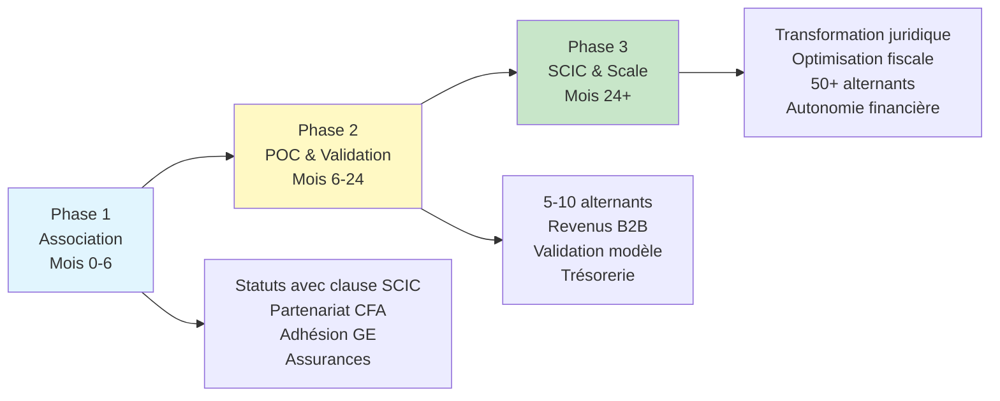
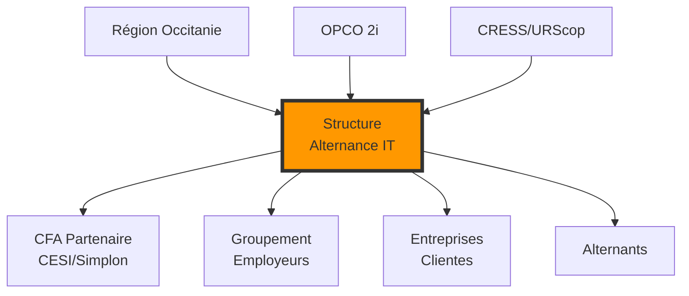

# 1. Vue d'ensemble - Alternance IT Occitanie

## Mission
Créer une structure d'alternance IT innovante en Occitanie, légalement conforme, économiquement viable.

## Trajectoire en 3 phases

## Chiffres clés

| Métrique | Année 1 | Année 2 | Année 3 |
|----------|---------|---------|---------|
| Alternants | 10 | 25 | 50 |
| Aides/alternant | 11,5-19,5k€ | 5-10k€ | 3-7k€ |
| Revenus B2B | 30-60k€ | 100-150k€ | 300-500k€ |
| Coût structure | 18k€ | 35k€ | 80k€ |
| Résultat net | 0-20k€ | 30-50k€ | 100-200k€ |

## Écosystème

## Différenciation
- **Cible** : Reconversions & jeunes sans réseau IT
- **Promesse** : Première expérience garantie en 3 mois
- **Innovation** : Plateforme de suivi + accompagnement intensif 100 premiers jours
