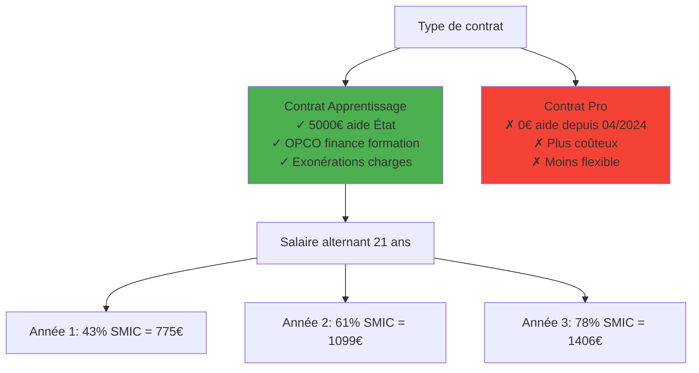
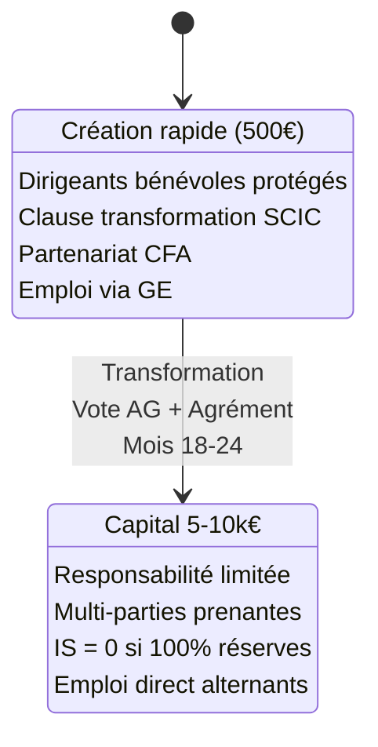
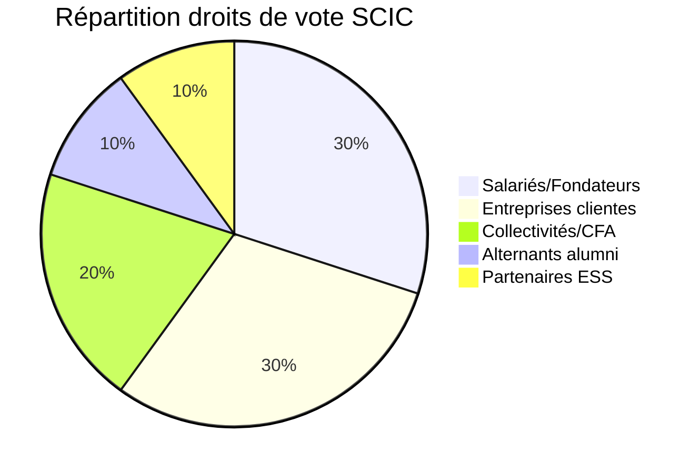
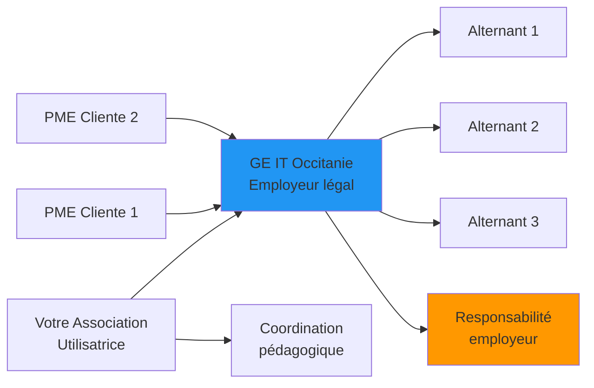

# 2. Modèle juridique & Conformité

## Choix du contrat : Apprentissage uniquement

## Obligations légales NON NÉGOCIABLES

| ⛔ INTERDIT | ✅ OBLIGATOIRE | 🔧 SOLUTION CONFORME |
|-------------|----------------|---------------------|
| Mentorat 100% IA | Maître apprentissage humain | IA en support uniquement |
| Auto-organisation | Subordination employeur | Autonomie encadrée/Agile |
| Frais aux alternants | Gratuité totale formation | Revenus B2B exclusivement |
| Absence supervision | DUER + suivi hebdo | Process documentés |

## Structure juridique optimale

## Gouvernance SCIC

## Assurances critiques (12k€/an)

1. **RC Pro** : 2k€/an - Dommages tiers
2. **RCMS** : 3-5k€/an - Protection patrimoine dirigeants ⚠️ CRITIQUE
3. **Cyber** : 2k€/an - Ransomware/RGPD
4. **Mutuelle** : 3-4k€/an - Obligatoire alternants
5. **AGS** : Via URSSAF - Automatique

## Montage avec Groupement d'Employeurs

## Checklist conformité

- [ ] Maître apprentissage désigné (2 ans XP ou diplôme+1an)
- [ ] Ratio 1 maître / 2 apprentis max
- [ ] Formation théorique 25% minimum via CFA Qualiopi
- [ ] DUER rédigé et à jour
- [ ] Visite médicale sous 2 mois
- [ ] Contrats conformes CERFA
- [ ] Zéro facturation alternants
- [ ] Traçabilité supervision hebdo
