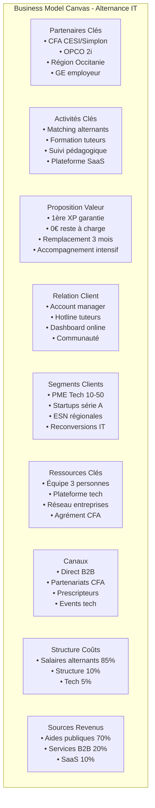

# 6. Templates & Outils pratiques

## Template 1 : Pitch deck investisseur (1 slide)

```
🎯 ALTERNANCE IT OCCITANIE
"La première expérience IT garantie pour tous"

PROBLÈME : 75% des reconversions IT échouent faute d'accompagnement
SOLUTION : Structure d'alternance avec mentorat intensif 100 premiers jours
MARCHÉ : 2000 postes IT non pourvus en Occitanie/an

TRACTION : 
• 3 entreprises clientes signées
• Partenariat CESI Toulouse
• 10 candidats pré-sélectionnés

MODÈLE : B2B 2.5k€/placement + SaaS 99€/mois
DEMANDE : 50k€ pour 18 mois runway → 50 alternants placés
```

## Template 2 : Email approche entreprise

```
Objet : Recrutez un développeur junior pour 0€ la première année

Bonjour [Nom],

Vous cherchez à renforcer votre équipe tech sans exploser votre budget ?

Notre structure d'alternance IT vous propose :
✓ Développeur junior opérationnel en 3 mois
✓ 0€ de reste à charge année 1 (après aides)
✓ Accompagnement du tuteur inclus
✓ Remplacement garanti si échec

3 entreprises de Toulouse nous font déjà confiance.

15 min d'échange cette semaine ?

[Signature]
P.S : Places limitées pour la rentrée de septembre
```

## Template 3 : Grille entretien validation marché

```markdown
ENTREPRISE : _________________ DATE : _______
CONTACT : ___________________ RÔLE : _______

1. CONTEXTE
□ Nb salariés IT actuels : ____
□ Nb recrutements IT prévus : ____
□ Expérience alternance : OUI/NON

2. DOULEURS (noter verbatim)
_________________________________________

3. BUDGET
□ Coût recrutement actuel : ____€
□ Budget formation : ____€/an

4. TEST OFFRE
Pack Recrutement 2500€ : 
□ Très intéressé □ Intéressé □ Pas intéressé

Pack Formation Tuteur 1500€ :
□ Très intéressé □ Intéressé □ Pas intéressé

Plateforme 99€/mois :
□ Très intéressé □ Intéressé □ Pas intéressé

5. ENGAGEMENT
□ Lettre intention □ Pilot □ Contact later
NEXT STEP : _____________________________
```

## Template 4 : Business Model Canvas



## Template 5 : Tableau de bord KPIs

| KPI | Formule | Objectif M6 | Objectif M12 | Alert |
|-----|---------|-------------|--------------|-------|
| **FINANCE** |
| Trésorerie | Cash disponible | > 15k€ | > 30k€ | < 10k€ |
| % Revenus B2B | B2B/Total | > 20% | > 30% | < 15% |
| CAC | Coût acquisition/client | < 500€ | < 300€ | > 800€ |
| **OPÉRATIONS** |
| Nb alternants | Total contrats | 3 | 10 | - |
| Taux placement | Placés/Candidats | > 70% | > 80% | < 50% |
| Taux rupture | Ruptures/Total | < 15% | < 10% | > 20% |
| **SATISFACTION** |
| NPS alternants | Score 0-10 | > 7 | > 8 | < 6 |
| NPS entreprises | Score 0-10 | > 7 | > 8 | < 6 |
| Délai placement | Jours moyens | < 45j | < 30j | > 60j |

## Template 6 : Checklist lancement

### ✅ Semaine 1
- [ ] Appel CRESS Occitanie : 04 67 60 20 28
- [ ] RDV avocat ESS (budget 500€)
- [ ] Contact CRGE : contact@crge-occitanie.fr
- [ ] Création compte GitHub/Notion pour doc
- [ ] Liste 30 entreprises cibles (LinkedIn Sales Navigator)

### ✅ Semaine 2
- [ ] 5 premiers appels entreprises
- [ ] Rédaction statuts Association v1
- [ ] Devis assurances (3 courtiers minimum)
- [ ] Contact CESI : toulouse@cesi.fr
- [ ] Post LinkedIn recherche cofondateurs

### ✅ Mois 1
- [ ] 20 entretiens entreprises complétés
- [ ] 3 lettres intention signées
- [ ] Association créée en préfecture
- [ ] Compte bancaire pro ouvert
- [ ] SIRET obtenu

### ✅ Mois 2
- [ ] Assurances souscrites (RC Pro + RCMS)
- [ ] Convention CFA signée
- [ ] Adhésion/création GE finalisée
- [ ] Plateforme MVP en ligne
- [ ] 3 premiers alternants identifiés

## Template 7 : Budget prévisionnel Excel

```
| MOIS        | M1   | M2   | M3   | M4   | M5   | M6   |
|-------------|------|------|------|------|------|------|
| REVENUS     |      |      |      |      |      |      |
| Capital     | 20k  | -    | -    | 10k  | -    | -    |
| Aides État  | -    | -    | -    | -    | -    | 15k  |
| OPCO        | -    | -    | -    | -    | 10k  | 15k  |
| B2B Services| -    | -    | 2.5k | 2.5k | 5k   | 5k   |
| TOTAL IN    | 20k  | 0    | 2.5k | 12.5k| 15k  | 35k  |
|-------------|------|------|------|------|------|------|
| CHARGES     |      |      |      |      |      |      |
| Salaires    | -    | -    | -    | -    | 6k   | 12k  |
| Assurances  | 1k   | 0.5k | 0.5k | 0.5k | 0.5k | 0.5k |
| Structure   | 3k   | 1k   | 1k   | 1k   | 1k   | 1k   |
| TOTAL OUT   | 4k   | 1.5k | 1.5k | 1.5k | 7.5k | 13.5k|
|-------------|------|------|------|------|------|------|
| SOLDE MOIS  | +16k | -1.5k| +1k  | +11k | +7.5k| +21.5k|
| CUMUL       | 16k  | 14.5k| 15.5k| 26.5k| 34k  | 55.5k|
```

## Template 8 : Clause transformation Association → SCIC

```
Article X - Transformation en SCIC

L'Association peut être transformée en Société Coopérative 
d'Intérêt Collectif (SCIC) par décision de l'Assemblée 
Générale Extraordinaire prise à la majorité simple des 
membres présents ou représentés.

Cette transformation n'entraîne pas création d'une personne 
morale nouvelle. Les contrats, conventions et autorisations 
de toute nature sont automatiquement transférés.

Le Conseil d'Administration est mandaté pour :
- Préparer les statuts de la future SCIC
- Organiser la souscription du capital
- Solliciter l'agrément préfectoral
- Accomplir toutes formalités nécessaires
```

---
*Ces templates sont à adapter selon votre contexte spécifique*
*Validation juridique recommandée avant utilisation*
