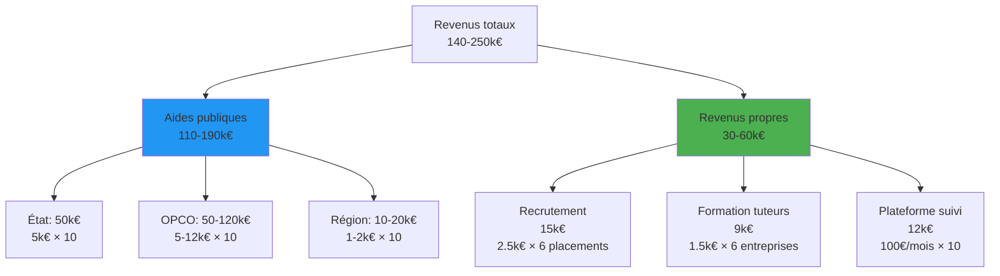
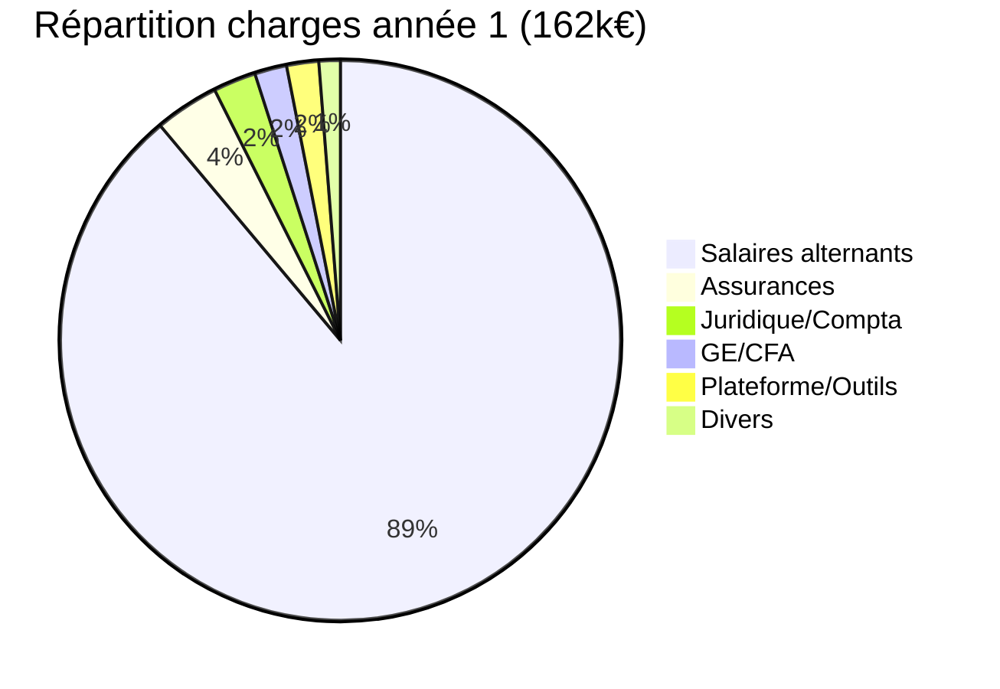
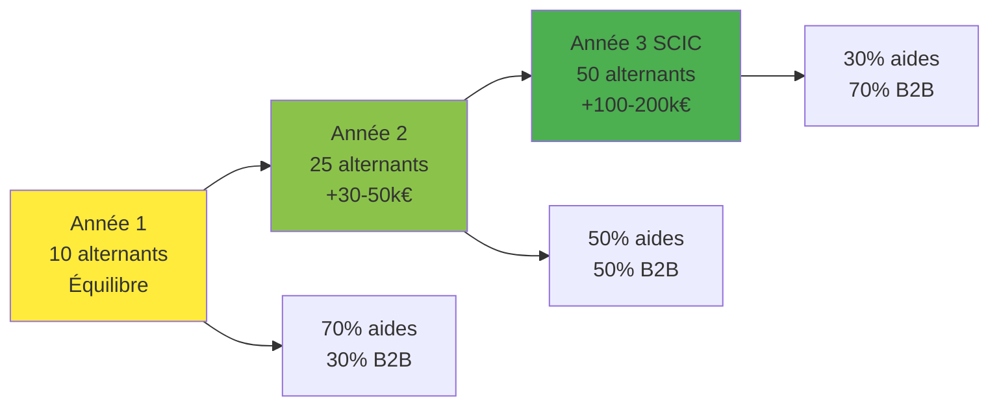
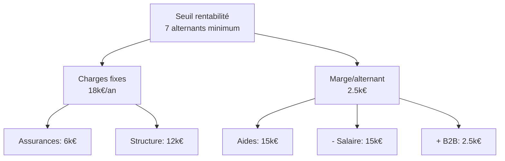

# 3. Modèle économique & Financement

## Sources de revenus - Année 1 (10 alternants)

## Structure de coûts - Année 1

## Empilement aides par alternant

| Source | Année 1 | Conditions |
|--------|---------|------------|
| État | 5 000€ | < 250 salariés |
| OPCO formation | 5-12 000€ | Selon niveau |
| OPCO équipement | 500€ | Premier matériel |
| Région CFA | 1-2 000€ | Numérique/ZRR |
| **TOTAL** | **11,5-19,5k€** | |

## Offres B2B détaillées

### Pack Recrutement (2 500€)
- Sourcing & présélection (20 candidats → 3 finalistes)
- Tests techniques automatisés
- Garantie remplacement 3 mois

### Pack Formation Tuteurs (1 500€)
- Formation 2 jours maître apprentissage
- Certification conforme réglementation
- Kit outils de suivi + hotline 6 mois

### Plateforme SaaS (99€/mois/alternant)
- Dashboard suivi compétences
- Génération rapports légaux
- Chat support IA intégré
- Matching projets/profils

## Trajectoire financière 3 ans

## Seuil de rentabilité

## Plan trésorerie année 1

| Trim | Entrées | Sorties | Solde | Cumul |
|------|---------|---------|-------|-------|
| T1 | 20k€ (capital) | 15k€ | +5k€ | 5k€ |
| T2 | 35k€ (aides+B2B) | 40k€ | -5k€ | 0k€ |
| T3 | 45k€ | 41k€ | +4k€ | 4k€ |
| T4 | 50k€ | 46k€ | +4k€ | 8k€ |

⚠️ **Point critique T2** : Prévoir ligne de crédit 10k€
