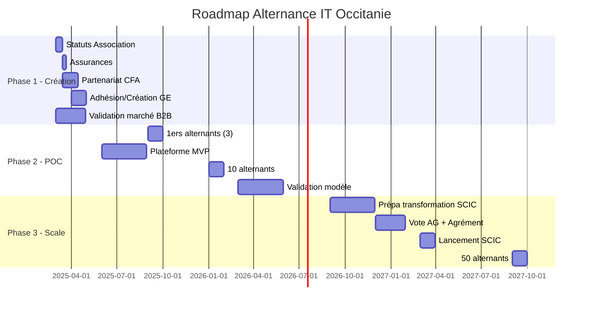
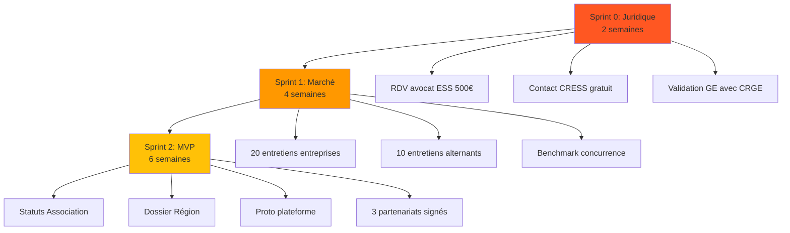
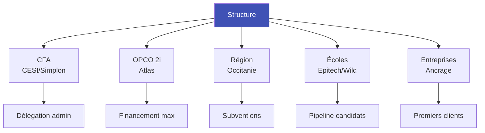
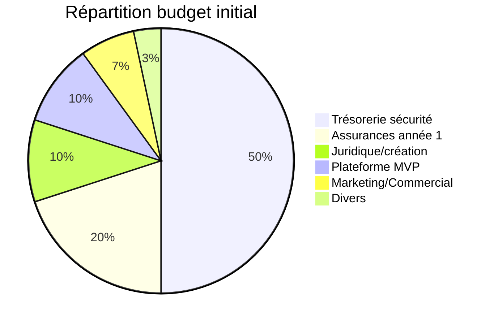

# 4. Plan d'action & Roadmap

## Roadmap globale 36 mois



## Actions immédiates (Sprint 0-1-2)



## Validation marché B2B

### Cibles prioritaires
1. **PME Tech 10-50 salariés** sans RH dédié
2. **Startups en croissance** post-seed/série A
3. **ESN régionales** pour overflow projets

### Script entretien (15 min)
```
1. Recrutement IT actuel ? (douleurs)
2. Expérience alternance ? (freins)
3. Budget formation/recrutement ?
4. Intérêt pack à 2500€ ?
5. Features plateforme souhaitées ?
```

### KPIs validation
- [ ] 30% intérêt fort (6/20 entreprises)
- [ ] 3 lettres d'intention signées
- [ ] Prix validé par 50% prospects

## Partenariats stratégiques



## Équipe fondatrice requise

| Rôle | Profil | Missions | Trouvé ? |
|------|--------|----------|----------|
| CEO | Commercial/Réseau | Partenariats, levée | ❌ |
| COO | RH/Formation | Conformité, pédagogie | ❌ |
| CTO | Tech/Produit | Plateforme, IA légale | ❌ |

## Budget lancement (30k€)



## Demandes subventions - Calendrier

| Échéance | Organisme | Montant | Action |
|----------|-----------|---------|--------|
| Mars 2025 | Région Occitanie | 20-50k€ | Dossier ESS numérique |
| Avril 2025 | Réalis incubateur | 0€ | Candidature accompagnement |
| Mai 2025 | France Active | 10-30k€ | Garantie bancaire |
| Juin 2025 | BPI France | 30-60k€ | Aide innovation |
| Sept 2025 | OPCO 2i | Variable | Convention financement |

## Métriques de succès

### 6 mois
- [ ] Association créée avec assurances
- [ ] 1 CFA partenaire signé
- [ ] 3 entreprises clientes confirmées
- [ ] Plateforme MVP fonctionnelle

### 12 mois
- [ ] 5 alternants placés
- [ ] 15k€ revenus B2B
- [ ] NPS alternants > 8/10
- [ ] Trésorerie 3 mois

### 24 mois
- [ ] 20 alternants actifs
- [ ] 100k€ revenus B2B
- [ ] Transformation SCIC votée
- [ ] Équilibre financier atteint

### 36 mois
- [ ] 50 alternants
- [ ] 300k€ revenus B2B
- [ ] 70% revenus hors aides
- [ ] Expansion Nouvelle-Aquitaine
