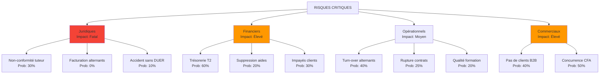
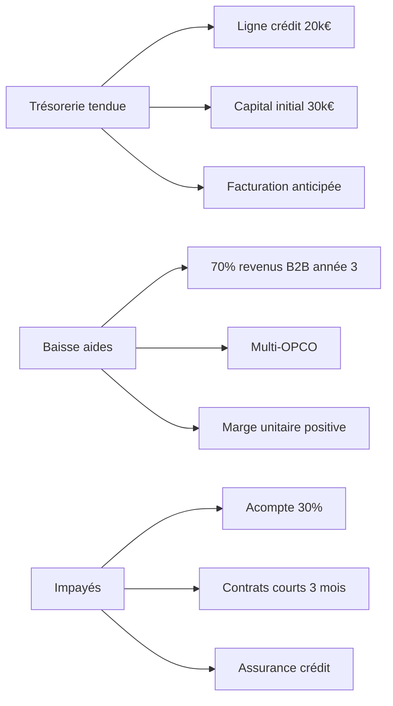
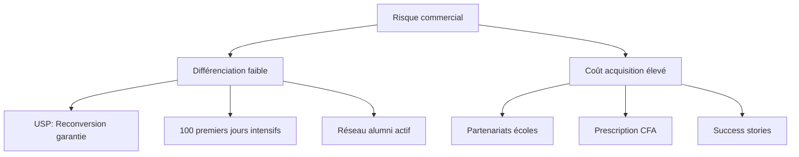
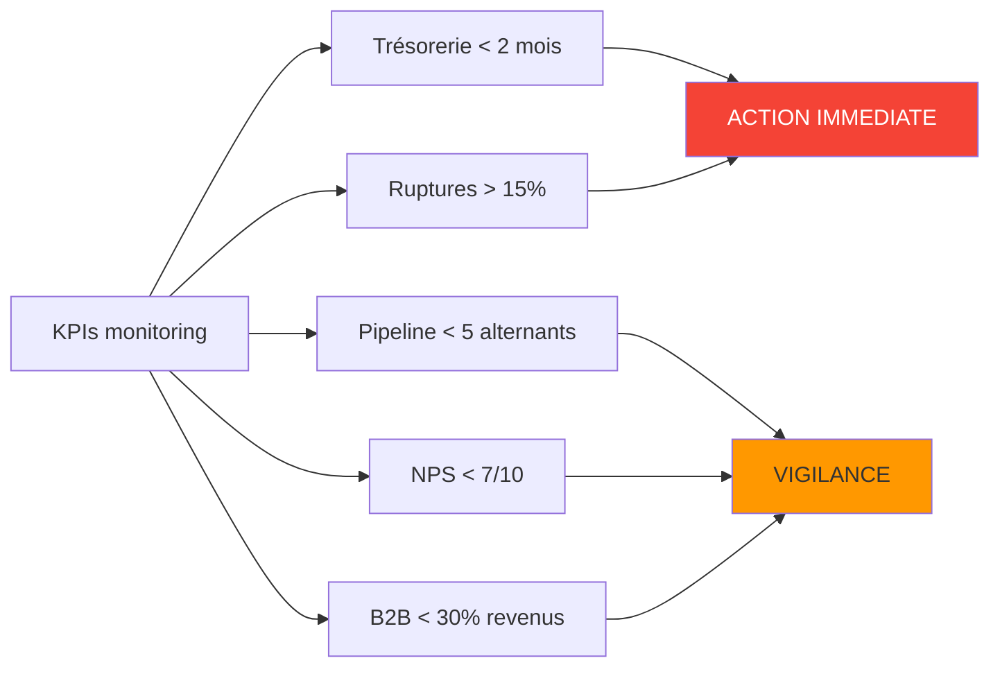

# 5. Gestion des risques & Mitigation

## Matrice des risques

## Plans de mitigation

### 🔴 Risques juridiques (Priorité 1)

| Risque | Mitigation | Coût | Responsable |
|--------|------------|------|-------------|
| Non-conformité tuteur | • Formation obligatoire tuteurs • Checklist hebdo supervision • Audit trimestriel DREETS | 2k€/an | COO |
| Facturation interdite | • ZÉRO frais alternants • Audit tous contrats • Formation équipe | 0€ | CEO |
| Accident/DUER | • DUER jour 1 • MAJ trimestrielle • Formation sécurité | 1k€ | COO |
| Responsabilité dirigeants | • RCMS 5k€/an • Pas de garantie perso • GE phase 1 | 5k€/an | CEO |

### 🟠 Risques financiers (Priorité 2)

### 🟡 Risques opérationnels (Priorité 3)

| Problème | Indicateur alerte | Action corrective |
|----------|------------------|-------------------|
| Turn-over alternants | > 20% ruptures | • Sélection renforcée • Mentorat intensifié mois 1-3 |
| Qualité formation | NPS < 7/10 | • Audit CFA partenaire • Formation tuteurs |
| Charge admin | > 0.5 ETP/10 alt | • Automatisation max • Externalisation compta |
| Matching entreprises | < 70% placement | • Élargir réseau • Pré-formation candidats |

### 🟢 Risques commerciaux (Priorité 4)

## Scénarios de crise

### Scénario 1 : Contrôle DREETS négatif
1. **J+0** : Avocat spécialisé droit social
2. **J+7** : Plan conformité 30 jours
3. **J+30** : Régularisation complète
4. **Budget** : 10-20k€ provision

### Scénario 2 : Perte CFA partenaire
1. **Backup** : 2 CFA en négociation permanente
2. **Délai bascule** : 3 mois max
3. **Communication** : Transparence alternants/entreprises

### Scénario 3 : Trésorerie -10k€
1. **Levier 1** : Facturation anticipée B2B (5k€)
2. **Levier 2** : Découvert autorisé (10k€)
3. **Levier 3** : Apport personnel dirigeants
4. **Levier 4** : Crowdfunding ESS

## Signaux d'alerte précoce

## Points de non-retour

- ❌ **Ne JAMAIS** facturer les alternants (pénal)
- ❌ **Ne JAMAIS** signer sans maître d'apprentissage
- ❌ **Ne JAMAIS** garantir personnellement un prêt
- ❌ **Ne JAMAIS** démarrer sans assurances RCMS
- ❌ **Ne JAMAIS** promettre du mentorat 100% IA

## Budget risques année 1

| Poste | Montant | % Budget |
|-------|---------|----------|
| Assurances | 12k€ | 40% |
| Provision juridique | 10k€ | 33% |
| Trésorerie sécurité | 5k€ | 17% |
| Formation conformité | 3k€ | 10% |
| **TOTAL** | **30k€** | **100%** |

## Conclusion

✅ **Projet viable SI** respect strict du cadre légal  
✅ **ROI positif** dès année 2 avec discipline commerciale  
✅ **Protection maximale** via GE → Association → SCIC  
⚠️ **Risque principal** : Dépendance aides publiques → Diversification B2B urgente
